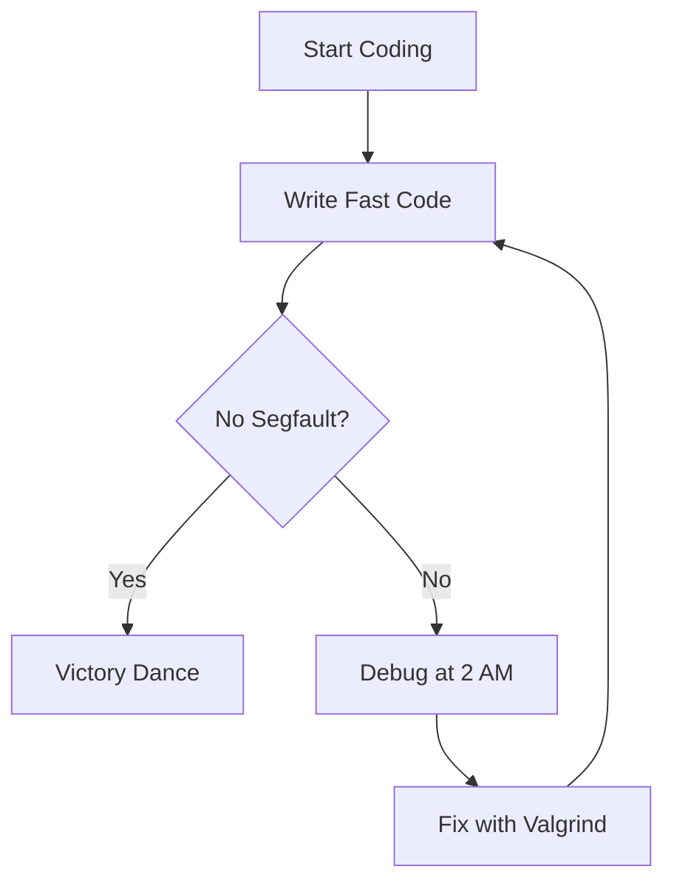
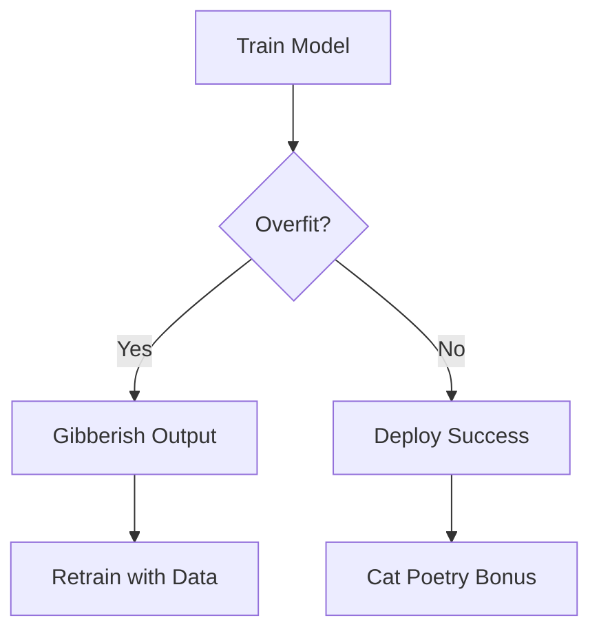
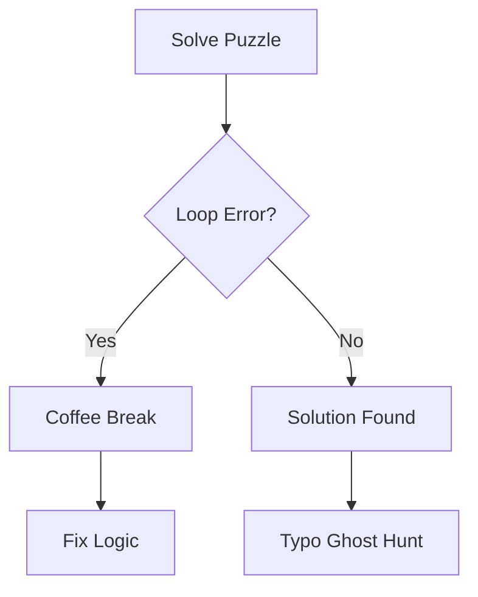

# Welcome to my Journery as a Computer Scientist.

Thrilling Skills Showcase: My Coding Circus of Chaos and Triumph! 🤡🚀
Step right up to the greatest coding circus on Earth! I juggle low-level C++, AI wizardry, and dynamic programming algorithms with flair—though not without some hilarious stumbles along the way. Expect epic wins, epic fails, and diagrams to prove it! Here’s the wild rundown:
C++ Low-Level Programming: Wrestling the Machine’s Gremlins 🔥

Bare-Metal Mastery: I tame hardware like a lion tamer, writing code so fast it leaves the CPU dizzy; until a segfault sneaks in and I’m debugging at 2 AM! 😅
Memory Manipulation: I twirl pointers like a circus baton, but oh boy, those memory leaks turned my app into a swamp—learned to drain it with valgrind the hard way!
Multithreading Thrills: I wrangle threads like a clown on a unicycle, but deadlocks once crashed my server; now I lock, step with mutexes like a pro.
Assembly Integration: I sprinkle assembly for a speed boost, only to trip over a misaligned register laughing through the tears as I fix it!

AI: Building the Future with a Side of Glitches 🌌

Machine Learning Maverick: I train models that predict the future—until overfit data turned my chatbot into a gibberish generator! Retrained it with better data, phew!
Deep Learning Dynamo: I stack neural networks like pancakes, but GPU memory errors once fried my setup—now I batch like a chef under pressure.
Reinforcement Learning Rebel: I built agents to conquer games, but they flailed like drunk monkeys until I tuned the rewards—victory tastes sweeter now!
Natural Language Processing Ninja: I crafted LLMs that chat, but early versions spat out poetry about cats—prompt engineering saved the day!

Dynamic Programming Algorithms: Solving Puzzles with a Chuckle 🎯

Optimal Pathfinding Pro: I blaze trails with Dijkstra’s, but got lost in a graph loop once—rescued by a coffee break and a rethink!
Knapsack Conqueror: I pack bags like a pro, though I once overflowed the constraint and laughed as my solution crashed—adjusted weights and won!
Fibonacci Wizard: I memoize Fibonacci like a memory champ, but forgot to clear the cache once—my program slowed to a snail’s pace, hilarious fix!
Longest Common Subsequence Legend: I align sequences with flair, but a typo in the matrix had me chasing ghosts—debugged with a grin!

Buckle up; this coding circus has seen me trip over segfaults, overfit models, and recursive rabbit holes, but I’ve bounced back with humor and grit! With these skills, I assure you. I’m ready to tackle any challenge, obsticle. let’s build something epic (and maybe a little quirky) together! 💥😂